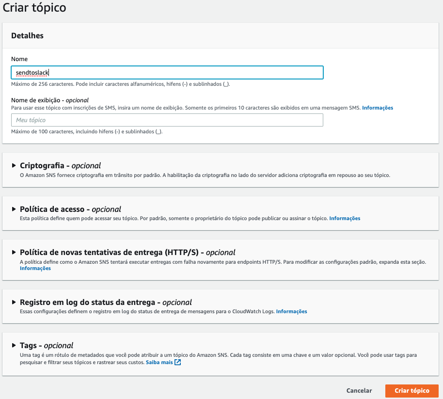
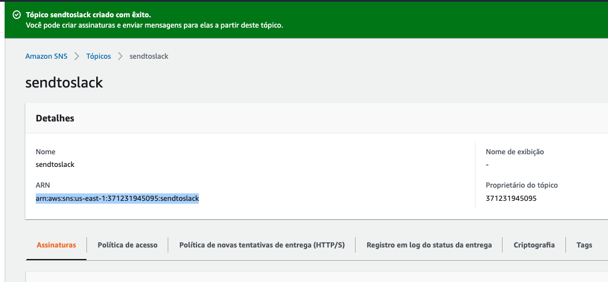
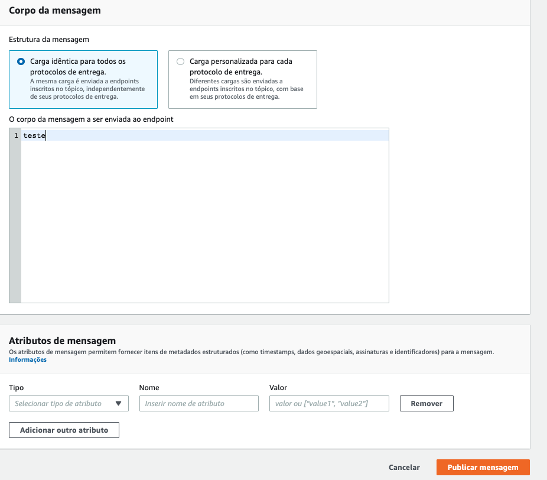

# Aula 05.3 - Lambda

1. No terminal do IDE criado no cloud9 execute o comando `cd ~/environment/hybridnativecloud-exercises-serverless/03\ -\ SNS/` para entrar na pasta que fara este exercicio.
2. Crie uma pasta chamada layer com o comando `mkdir layer` no terminal
3. Execute o comando `pip3 install -r requirements.txt -t layer/` para que todas as dependecias fiquem dentro desta pasta.
4. Vamos criar o SNS que será utilizado no exercicio, para isso abra uma aba do console e vá para o serviço SNS. No menu lateral do serviço clique em Tópicos.
   
5. No canto superior direito clique em Criar tópico
6. Preencha o nome do tópico e clique em Criar Tópico 
   
7. O ARN que será utlizado no código esta na pagina do Tópico que criou
   
8.  Crie um arquivo 'serverless.yml' com o seguinte conteudo

9. Crie um arquivo 'lambda.py' com o seguinte conteudo

10. Na URL do slack deixe o seguinte conteudo que esta no dontpad
11. No channel coloque o seguinte `#atividade-slack`
12. Execute o comando `sls deploy`
13. Agora cada vez que você publicar uma mensagem para o SNS irá receber uma mensagem no slack
14. Para enviar uma mensagem vá até o console SNS do seu tópico e cliquem em `Publicar mensagem` no canto superior direito da tela.
15. Preencha o corpo da mensagem com o conteudo desejado e clique em `Publicar mensagem`
    
16. Sua mensagem aparecerá no Slack

